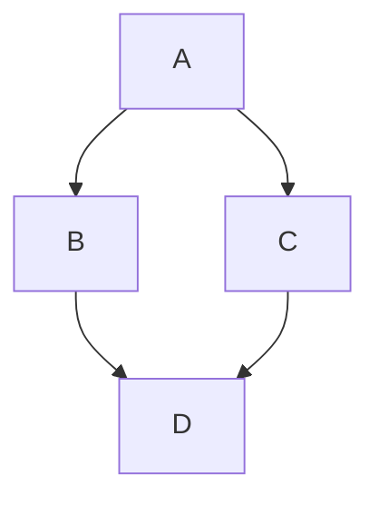

# Markdown märgendite ülevaateleht

Markdown on lihtne ja laialt levinud märgenduskeel, mida kasutatakse teksti vormindamiseks. See loodi eesmärgiga olla kergesti loetav ja kirjutatav, võimaldades samal ajal teisendamist HTML-i ja teistesse vormingutesse. Käesolev ülevaateleht tutvustab kõiki peamisi Markdown märgendeid koos näidetega.

## Sisukord

1. [Pealkirjad](#pealkirjad)
2. [Tekstistiilid](#tekstistiilid)
3. [Lõigud ja reavahetused](#lõigud-ja-reavahetused)
4. [Loendid](#loendid)
5. [Lingid](#lingid)
6. [Pildid](#pildid)
7. [Koodiplokid](#koodiplokid)
8. [Tabelid](#tabelid)
9. [Tsitaadid](#tsitaadid)
10. [Horisontaalsed jooned](#horisontaalsed-jooned)
11. [Kontrollnimekirjad](#kontrollnimekirjad)
12. [Joonealused märkused](#joonealused-märkused)
13. [Definitsioonid](#definitsioonid)
14. [Läbikriipsutatud tekst](#läbikriipsutatud-tekst)
15. [Emoji](#emoji)
16. [HTML Markdown-is](#html-markdown-is)
17. [Matemaatilised valemid](#matemaatilised-valemid)
18. [Diagrammid](#diagrammid)
19. [Laiendatud süntaks](#laiendatud-süntaks)
20. [Markdown redaktorid](#markdown-redaktorid)

## Pealkirjad

Markdown-is saab luua kuut erinevat taseme pealkirja, kasutades numbrile vastavat arvu trellimärke (#).

```markdown
# Pealkiri 1
## Pealkiri 2
### Pealkiri 3
#### Pealkiri 4
##### Pealkiri 5
###### Pealkiri 6
```

Tulemus:

# Pealkiri 1
## Pealkiri 2
### Pealkiri 3
#### Pealkiri 4
##### Pealkiri 5
###### Pealkiri 6

Alternatiivne süntaks esimese ja teise taseme pealkirjade jaoks:

```markdown
Pealkiri 1
=========

Pealkiri 2
---------
```

## Tekstistiilid

### Rõhutatud tekst (kaldkiri)

```markdown
*See tekst on kaldkirjas*
_See tekst on samuti kaldkirjas_
```

Tulemus:
*See tekst on kaldkirjas*
_See tekst on samuti kaldkirjas_

### Tugev rõhutus (paks kiri)

```markdown
**See tekst on paksus kirjas**
__See tekst on samuti paksus kirjas__
```

Tulemus:
**See tekst on paksus kirjas**
__See tekst on samuti paksus kirjas__

### Kombineeritud rõhutus

```markdown
**See tekst on _väga_ tähtis**
*See tekst on **samuti** tähtis*
```

Tulemus:
**See tekst on _väga_ tähtis**
*See tekst on **samuti** tähtis*

### Läbikriipsutatud tekst

```markdown
~~See tekst on läbikriipsutatud~~
```

Tulemus:
~~See tekst on läbikriipsutatud~~

## Lõigud ja reavahetused

Markdown-is eraldatakse lõigud tühja reaga:

```markdown
See on esimene lõik.

See on teine lõik.
```

Tulemus:

See on esimene lõik.

See on teine lõik.

Reavahetuse (uue rea) jaoks lisa rea lõppu kaks tühikut või kasuta HTML-i `<br>` elementi:

```markdown
See on esimene rida.  
See on teine rida.

Või kasuta <br> elementi.
See on uus rida.
```

Tulemus:

See on esimene rida.  
See on teine rida.

Või kasuta <br> elementi.
See on uus rida.

## Loendid

### Nummerdatud loendid

```markdown
1. Esimene element
2. Teine element
3. Kolmas element
   1. Taandega element
   2. Teine taandega element
4. Neljas element
```

Tulemus:

1. Esimene element
2. Teine element
3. Kolmas element
   1. Taandega element
   2. Teine taandega element
4. Neljas element

Markdown genereerib numbrid automaatselt, seega võid kasutada ka sama numbrit igal real:

```markdown
1. Esimene element
1. Teine element
1. Kolmas element
```

### Nummerdamata loendid

```markdown
- Esimene element
- Teine element
- Kolmas element
  - Taandega element
  - Teine taandega element
- Neljas element
```

Tulemus:

- Esimene element
- Teine element
- Kolmas element
  - Taandega element
  - Teine taandega element
- Neljas element

Nummerdamata loendite jaoks võid kasutada -, *, või + märke:

```markdown
* Esimene element
* Teine element

+ Esimene element
+ Teine element
```

### Segatud loendid

```markdown
1. Esimene nummerdatud element
   - Taandega nummerdamata element
   - Teine taandega nummerdamata element
2. Teine nummerdatud element
```

Tulemus:

1. Esimene nummerdatud element
   - Taandega nummerdamata element
   - Teine taandega nummerdamata element
2. Teine nummerdatud element

## Lingid

### Tavaline link

```markdown
[Markdowni juhend](https://www.markdownguide.org)
```

Tulemus:
[Markdowni juhend](https://www.markdownguide.org)

### Pealkirjaga link (hiirega üle liikudes kuvatakse pealkiri)

```markdown
[Markdowni juhend](https://www.markdownguide.org "Parim Markdowni ressurss")
```

Tulemus:
[Markdowni juhend](https://www.markdownguide.org "Parim Markdowni ressurss")

### URL-id ja e-posti aadressid

```markdown
<https://www.markdownguide.org>
<kasutaja@näide.com>
```

Tulemus:
<https://www.markdownguide.org>
<kasutaja@näide.com>

### Viitelingid

```markdown
[Markdowni juhend][1]
[Teine link][teine]

[1]: https://www.markdownguide.org
[teine]: https://www.example.com "Näite veebileht"
```

Tulemus:
[Markdowni juhend][1]
[Teine link][teine]

[1]: https://www.markdownguide.org
[teine]: https://www.example.com "Näite veebileht"

### Dokumendisisesed lingid

```markdown
[Mine pealkirjade juurde](#pealkirjad)
```

Tulemus:
[Mine pealkirjade juurde](#pealkirjad)

## Pildid

### Tavaline pilt

```markdown

```

Tulemus:


### Pealkirjaga pilt

```markdown

```

Tulemus:


### Viitepildid

```markdown
![Markdown Logo][logo]

[logo]: https://markdown-here.com/img/icon256.png "Markdown logo"
```

Tulemus:
![Markdown Logo][logo]

[logo]: https://markdown-here.com/img/icon256.png "Markdown logo"

### Pilt lingina

```markdown
[](https://www.markdownguide.org)
```

Tulemus:
[](https://www.markdownguide.org)

## Koodiplokid

### Reasisene kood

```markdown
Kasuta funktsiooni `print()` teksti kuvamiseks.
```

Tulemus:
Kasuta funktsiooni `print()` teksti kuvamiseks.

### Koodiplokid

Taandega koodiplokk (4 tühikut või 1 tabulaator):

```markdown
    # See on Pythoni kood
    def hello_world():
        print("Tere, maailm!")
```

Tulemus:

    # See on Pythoni kood
    def hello_world():
        print("Tere, maailm!")

Piiratud koodiplokk (kolm tagurpidi ülakomat):

````markdown
```
# See on Pythoni kood
def hello_world():
    print("Tere, maailm!")
```
````

Tulemus:

```
# See on Pythoni kood
def hello_world():
    print("Tere, maailm!")
```

### Süntaksi esiletõstmine

````markdown
```python
# See on Pythoni kood süntaksi esiletõstmisega
def hello_world():
    print("Tere, maailm!")
```
````

Tulemus:

```python
# See on Pythoni kood süntaksi esiletõstmisega
def hello_world():
    print("Tere, maailm!")
```

## Tabelid

```markdown
| Päis 1 | Päis 2 | Päis 3 |
|--------|--------|--------|
| Rida 1, veerg 1 | Rida 1, veerg 2 | Rida 1, veerg 3 |
| Rida 2, veerg 1 | Rida 2, veerg 2 | Rida 2, veerg 3 |
| Rida 3, veerg 1 | Rida 3, veerg 2 | Rida 3, veerg 3 |
```

Tulemus:

| Päis 1 | Päis 2 | Päis 3 |
|--------|--------|--------|
| Rida 1, veerg 1 | Rida 1, veerg 2 | Rida 1, veerg 3 |
| Rida 2, veerg 1 | Rida 2, veerg 2 | Rida 2, veerg 3 |
| Rida 3, veerg 1 | Rida 3, veerg 2 | Rida 3, veerg 3 |

### Joondamine tabelites

```markdown
| Vasakule joondatud | Keskele joondatud | Paremale joondatud |
|:-------------------|:-----------------:|-------------------:|
| Tekst | Tekst | Tekst |
| Pikem tekst | Pikem tekst | Pikem tekst |
```

Tulemus:

| Vasakule joondatud | Keskele joondatud | Paremale joondatud |
|:-------------------|:-----------------:|-------------------:|
| Tekst | Tekst | Tekst |
| Pikem tekst | Pikem tekst | Pikem tekst |

## Tsitaadid

```markdown
> See on tsitaat.
>
> See on tsitaadi teine lõik.
>> See on pesastatud tsitaat.
```

Tulemus:

> See on tsitaat.
>
> See on tsitaadi teine lõik.
>> See on pesastatud tsitaat.

## Horisontaalsed jooned

Horisontaalse joone loomiseks kasuta kolme või enamat tärni (***), miinust (---) või alakriipsu (___) eraldi real:

```markdown
***

---

___
```

Tulemus:

***

---

___

## Kontrollnimekirjad

```markdown
- [x] Lõpetatud ülesanne
- [ ] Lõpetamata ülesanne
- [ ] ~~Tühistatud ülesanne~~
```

Tulemus:

- [x] Lõpetatud ülesanne
- [ ] Lõpetamata ülesanne
- [ ] ~~Tühistatud ülesanne~~

## Joonealused märkused

```markdown
Siin on tekst joonealuse märkusega[^1].

[^1]: See on joonealune märkus.
```

Tulemus:

Siin on tekst joonealuse märkusega[^1].

[^1]: See on joonealune märkus.

## Definitsioonid

```markdown
term
: definitsioon
```

Tulemus:

term
: definitsioon

## Läbikriipsutatud tekst

```markdown
~~See tekst on läbikriipsutatud.~~
```

Tulemus:

~~See tekst on läbikriipsutatud.~~

## Emoji

Emoji lisamiseks kasuta kooloneid ja emoji koodi:

```markdown
:smile: :heart: :thumbsup:
```

Tulemus:

:smile: :heart: :thumbsup:
`:bowtie:` :bowtie:

😃 
| :bowtie: `:bowtie:` | :smile: `:smile:` | :laughing: `:laughing:` |
| :zipper_mouth_face: | `:zipper_mouth_face:` | :raised_eyebrow: | `:raised_eyebrow:` |

## HTML Markdown-is

Markdown toetab HTML-i kasutamist:

```markdown 
<div style="color: red;">
  See tekst on punane.
</div>

<table>
  <tr>
    <td>Rida 1, veerg 1</td>
    <td>Rida 1, veerg 2</td>
  </tr>
  <tr>
    <td>Rida 2, veerg 1</td>
    <td>Rida 2, veerg 2</td>
  </tr>
</table>
```

Tulemus:

<div style="color: red;">
  See tekst on punane.
</div>

<table>
  <tr>
    <td>Rida 1, veerg 1</td>
    <td>Rida 1, veerg 2</td>
  </tr>
  <tr>
    <td>Rida 2, veerg 1</td>
    <td>Rida 2, veerg 2</td>
  </tr>
</table>

## Matemaatilised valemid

Paljud Markdown protsessorid toetavad LaTeX süntaksit matemaatiliste valemite jaoks:

```markdown
Reasisene valem: $E=mc^2$

Eraldi real olev valem:

$$
\frac{n!}{k!(n-k)!} = \binom{n}{k}
$$
```

Tulemus (kui toetatud, aga Hugo seda ei toeta):

Reasisene valem: $E=mc^2$

Eraldi real olev valem:

$$
\frac{n!}{k!(n-k)!} = \binom{n}{k}
$$

\[
\frac{n!}{k!(n-k)!} = \binom{n}{k}
\]

## Matemaatika

Siin on võrrand, mida tahaks näha: \( x = {-b \pm \sqrt{b^2-4ac} \over 2a} \)


## Diagrammid

Mõned Markdown protsessorid toetavad diagrammide loomist Mermaid või muude süntaksite abil:

````markdown

````

Tulemus (kui toetatud):


## Laiendatud süntaks

Erinevad Markdown laiendused pakuvad täiendavaid võimalusi:

### Ülaindeks

```markdown
X^2^
```

Tulemus (kui toetatud):
X^2^

### Alaindeks

```markdown
H~2~O
```

Tulemus (kui toetatud):
H~2~O

### Märgistatud tekst

```markdown
==Märgistatud tekst==
```

Tulemus (kui toetatud):
==Märgistatud tekst==

## Markdown redaktorid

Markdown-i kirjutamiseks on saadaval palju redaktoreid:

- **Visual Studio Code** - tasuta koodiredaktor laiendusega Markdown-i jaoks
- **Typora** - WYSIWYG Markdown redaktor
- **StackEdit** - veebipõhine Markdown redaktor
- **Dillinger** - veebipõhine Markdown redaktor
- **Obsidian** - teadmiste baasi rakendus Markdown toega
- **iA Writer** - minimalistlik Markdown redaktor
- **Notion** - märkmete tegemise rakendus Markdown toega

## Kokkuvõte

See ülevaateleht katab enamiku Markdown-i märgendeid ja süntaksit. Pea meeles, et mitte kõik Markdown protsessorid ei toeta kõiki siin kirjeldatud funktsioone, eriti laiendatud süntaksi omi. Alati kontrolli, milliseid funktsioone sinu kasutatav Markdown protsessor toetab.

Markdown-i õppimine on lihtne ja selle kasutamine muudab dokumentide vormindamise palju kiiremaks ja mugavamaks kui traditsiooniliste tekstiredaktorite kasutamine.

---

*See ülevaateleht on loodud õppematerjalina ja võib olla vabalt kasutatud ja jagatud.*
<!-- Lisa see kas lehe <head> või markdown.md lõppu (HTML plokina) -->
  <!-- Laadi MathJax 
<script src="https://polyfill.io/v3/polyfill.min.js?features=es6"></script>
<script id="MathJax-script" async
  src="https://cdn.jsdelivr.net/npm/mathjax@3/es5/tex-mml-chtml.js"></script>
-->
